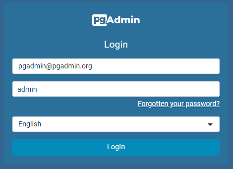
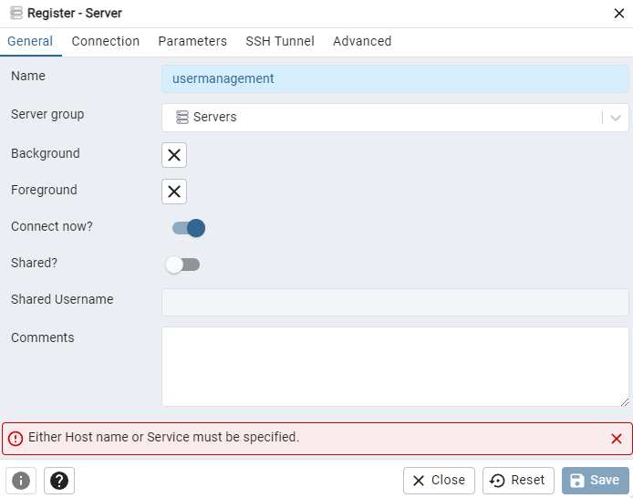
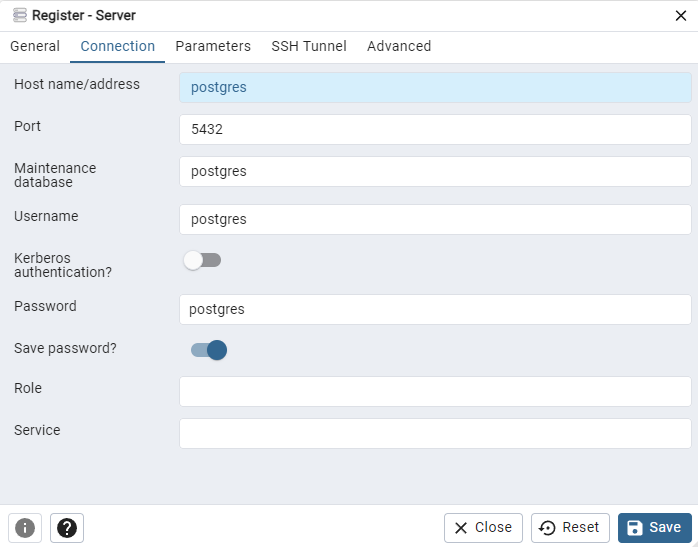

# User Management REST API

This project is a User Management Tool build in Java and Quarkus. It provides functionalitiy to manage users, including creating and deleting users, and updating user information. The project has a layered architecture with distinct layers for presentation, business logic, and data access.

## Initial startup
1. Download the repository on your local drive and go to project-root.
2. Run ```./gradlew build```.
3. Open Docker Desktop.
4. Run ```docker-compose -f src/main/docker/docker-compose.yml up -d``` to start and run postgres and pgadmin.
5. Go to http://localhost:5050/ and login with the following credentials:

6. Click the **Add New Server** button to register a new server.
7. Under the **General** tab fill in the fields as follow:

8. Go to **Connection** tab and fill in the fields as follow:

9. Click **Save**.
10. Run ```docker build -f src/main/docker/Dockerfile.jvm -t quarkus/code-with-quarkus-jvm .``` to build the application.
11. Run ```docker run -i --rm -p 8080:8080 quarkus/code-with-quarkus-jvm``` to run the application. A new database schema will be created and filled with sample data.
12. Now you should have the application in one container and postgresql server and pgadmin in another.

## [API Reference](http://localhost:8080/q/swagger-ui)


#### Get all users if no query parameters added

```http
  GET /users
```

| Parameter | Type     | Description                |
| :-------- | :------- | :------------------------- |
| `firstName`| `string` | **Optional**  |
| `lastName`| `string` | **Optional**  |
| `email`   | `string` | **Optional**   |

#### Get a user by email

```http
  GET /users/${email}
```

| Parameter | Type     | Description                       |
| :-------- | :------- | :-------------------------------- |
| `email`   | `string` | **Required**        |

#### add(num1, num2)

Takes two numbers and returns the sum.

#### Create a New User

```http
  POST users/create
```
**Required body**

    {
        "firstName": "string",
        "lastName": "string",
        "email": "string"
    }

#### Update existing user

```http
  PATCH users/update
```
**Required body**

    {
        "userId": 0,
        "firstName": "string",
        "lastName": "string",
        "email": "string",
        "address": "string",
        "phone": "string",
        "bio": "string"
    }

#### Delete a user

```http
  DELETE users/delete
```
**Required body**

    {
        "userId": 0,
        "firstName": "string",
        "lastName": "string",
        "email": "string",
        "address": "string",
        "phone": "string",
        "bio": "string"
    }

## Database

The project uses an PostgreSQL database for storing user information. The database schema is defined in the `schema.sql` file, and sample data can be found in the `import.sql` file.


## Used Technologies

- [Java](https://www.java.com/en/)
- [Quarkus](https://quarkus.io/)
- [Gradle](https://gradle.org/)
- [Panache ORM](https://thorben-janssen.com/introduction-panache/)
- [Hibernate](https://hibernate.org/orm/)
- [PostgreSQL](https://www.postgresql.org/)
- [Lombok](https://projectlombok.org/)
- [Mockito](https://site.mockito.org/)
- [Swagger](https://swagger.io/)
- [MapStruct](https://mapstruct.org/)

